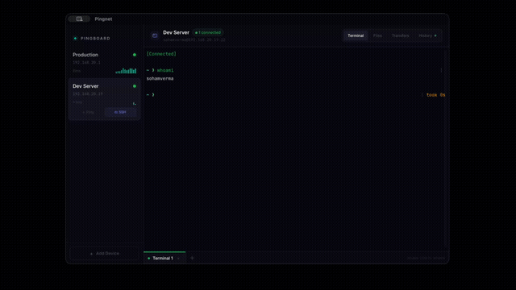

# Pingnet

A cross-platform network diagnostics desktop app for developers and sysadmins. Built with [Tauri 2](https://tauri.app), React, and Rust.


---

## Demo



> Full walkthrough video: see the [latest release](../../releases/latest) for a downloadable demo.

---

## Features

### Devices & Ping
- Add hosts by IP or hostname with custom display names
- Drag to reorder devices and group them into collapsible folders
- Dashboard of all your devices with live status
- One-click ping with real-time latency graph and an animated network route view
- Smart failure diagnostics — detects active VPNs, missing routes, DNS failures
- Animated diagnostic console with timestamped entries
- Per-host alerts (down, recovered, latency over threshold) as native desktop notifications
- Network Info — reverse DNS for each address and a TCP port scan from this machine
- Keyboard shortcuts for navigating hosts, pinging, and opening SSH (press `?` to see them)

### SSH Client (embedded)
- Full terminal emulator (xterm.js) directly in the app — no external terminal needed
- Multi-terminal tabs with rename support (like VS Code), plus a split pane
- Password, key file, SSH agent, app-generated keys (stored in the OS keychain), and TOTP / keyboard-interactive authentication
- Host key verification — confirm the server's `SHA256:` fingerprint on first connect
- Pre-flight connectivity check before every connection attempt
- Graceful connection-loss detection with one-click reconnect
- 8 terminal color themes (Dracula, Nord, Monokai, Solarized, and more)

### SFTP File Browser
- Browse, download, upload, rename, delete, and create folders over SSH
- Transfer queue with per-file progress
- Upload directly from your computer via drag-and-drop

### Command History
- Every command you run is persisted per host — survives disconnects and reboots
- Fish-style ghost-text autosuggestions from your history (Tab or → to accept)
- Captures tab-completed and up-arrow-recalled commands accurately by reading the terminal buffer
- History panel with search, grouped by tool, click-to-run
- Session audit log, with credentials redacted

### Remote Metrics
- CPU, memory, disk, network, load average, uptime, and a sortable process list
- Works on Linux, macOS, and Windows targets (OS detected on connect)
- Ports tab — the device's hostname/FQDN, public IP, and the sockets listening on it
- Partition manager with a queue-then-confirm workflow, and an A/B slot view for dual-partition devices

### Docker
- Containers — start, stop, restart, remove, rebuild, and view logs
- Compose projects — up, down, restart, and pull
- Images, volumes, and networks tabs; disk usage summary and prune
- Runs over the existing SSH session — no Docker daemon port to expose

### API Client
- HTTP client with method picker, headers, and JSON / form / text bodies
- Environment variables (`{{VARIABLE}}`) and saved collections per host
- SSH tunnel mode — call `localhost` services on the remote host without opening a port
- Secret headers and variables stored in the OS keychain

### More Tools
- Speed test (ping / download / upload via Cloudflare) on a remote host over SSH, or on this machine; pick a network interface to test
- Embedded Grafana dashboards per host
- Local terminal on this machine
- Light and dark themes
- In-app auto-update

---

## Installation

Download the latest release for your platform from the [Releases page](../../releases/latest).

### macOS

Requires **macOS 10.15 (Catalina) or later**. Download the `aarch64` `.dmg` for Apple silicon or the `x64` one for Intel Macs. Release builds are signed with a Developer ID certificate and notarized by Apple, so they open normally after you drag Pingnet.app into Applications.

If macOS refuses to open it, don't strip the quarantine flag — that hides a real problem (a damaged download or a broken signature). Check the app instead:

```bash
codesign --verify --deep --strict --verbose=2 /Applications/Pingnet.app
spctl --assess --type execute --verbose /Applications/Pingnet.app   # expect: accepted, source=Notarized Developer ID
xcrun stapler validate /Applications/Pingnet.app
```

If any of these fail, delete the app, download it again from the [Releases page](../../releases/latest), and [open an issue](../../issues/new) with the output if it still fails.

### Linux

```bash
# AppImage
chmod +x Pingnet_*_amd64.AppImage && ./Pingnet_*_amd64.AppImage

# .deb (Debian / Ubuntu)
sudo dpkg -i Pingnet_*_amd64.deb

# .rpm (Fedora / RHEL)
sudo rpm -i Pingnet-*.x86_64.rpm
```

### Windows

Run the `.msi` installer or the `.exe` setup file. If Windows Defender blocks it, click **More info → Run anyway**.

### SSH authentication

Pick the auth type per host when you connect:

| Type | Uses |
|---|---|
| **Password** | The account password |
| **Key File** | A private key on disk, e.g. `~/.ssh/id_ed25519` |
| **Agent** | Keys loaded into your SSH agent |
| **Keychain** | A key generated in Pingnet's SSH Key Manager and stored in the OS keychain (add its public key to the server's `authorized_keys`) |
| **TOTP** | Keyboard-interactive login with a one-time code |

**Agent mode needs keys loaded in the agent.** If you see `SSH agent auth failed: [Session(-34)] no identities found in the ssh agent`, the agent is empty. Plain `ssh` in a terminal can still work in that case, because it reads `~/.ssh/id_*` directly — Pingnet's Agent mode only asks the agent. Either switch the host to **Key File**, or load your key:

```bash
ssh-add -l                                          # "The agent has no identities." = empty
ssh-add --apple-use-keychain ~/.ssh/id_ed25519      # macOS (plain `ssh-add <key>` on Linux/Windows)
```

On macOS the agent starts empty after every reboot. With this in `~/.ssh/config`, your key is added to the agent the first time you use `ssh` after a reboot (or run `ssh-add --apple-use-keychain` once per boot):

```
Host *
  AddKeysToAgent yes
  UseKeychain yes
```

---

## Getting Started

### Prerequisites

| Tool | Install |
|------|---------|
| Rust + Cargo | https://rustup.rs |
| Node.js 20.19+ or 22.12+ (see `.nvmrc`) | https://nodejs.org |
| Xcode CLI (macOS) | `xcode-select --install` |

### Dev

```bash
npm install
npm run tauri dev
```

> **First run after cloning:** the `ssh2` crate compiles OpenSSL from source (~3–5 min). Subsequent builds are fast.

### Build (packaged app)

```bash
npm run tauri build
```

Outputs:
- **macOS** — `src-tauri/target/release/bundle/macos/Pingnet.app` + `.dmg`
- **Linux** — `src-tauri/target/release/bundle/appimage/*.AppImage` + `deb/*.deb` + `rpm/*.rpm`
- **Windows** — `src-tauri/target/release/bundle/msi/*.msi` + `nsis/*-setup.exe`

### Quick start (macOS)

Double-click `run-dev.command` in the project root. It checks dependencies, clears the dev port, and launches the app.

---

## Project Structure

```
src/                          React + TypeScript frontend
  App.tsx                     Root layout — sidebar, views, keyboard shortcuts
  types.ts                    Shared TypeScript types
  components/
    Sidebar.tsx               Device list, folders, drag-to-sort
    DashboardView.tsx         Overview of all devices
    HostDetailView.tsx        Ping view — latency chart, diagnostics
    NetworkInfoPanel.tsx      Reverse DNS + port scan
    KeyManager.tsx            SSH key generation (OS keychain)
    LocalTerminalView.tsx     Terminal on this machine
    ssh/
      SSHSessionView.tsx      SSH view — tab bar, split pane, panel routing
      SSHTerminal.tsx         xterm.js terminal + ghost-text suggestions
      SFTPBrowser.tsx         File browser + TransferQueue.tsx
      CommandHistory.tsx      Command history + audit log
      MetricsPanel.tsx        Remote metrics, ports, partitions
      DockerManager.tsx       Containers, compose, images, volumes, networks
      ApiClient.tsx           HTTP client with SSH tunnel mode
      Speedtest.tsx           Cloudflare speed test
  hooks/                      Ping state, polling, theme, update check
  utils/                      Pure helpers (unit-tested in tests/)

src-tauri/src/                Rust backend
  lib.rs                      Tauri command registration
  ping.rs / vpn.rs            Ping, error classification, VPN detection
  storage.rs                  JSON host persistence (app data dir)
  ssh.rs / remote.rs          SSH shell, SFTP, remote command execution
  keys.rs / api_secrets.rs    OS-keychain storage for SSH keys and API secrets
  command_history.rs / audit.rs / secrets.rs
                              History, audit log, credential redaction
  metrics.rs / docker.rs      Remote metrics and Docker management
  netinfo.rs                  DNS lookups and port scanning
  http_client.rs / tunnel_tls.rs
                              API client, TLS over SSH tunnels
  speedtest.rs                Speed test
  local_pty.rs                Local terminal
```

---

## Tech Stack

| Layer | Technology |
|-------|-----------|
| Desktop shell | Tauri 2 |
| Frontend | React 18 + TypeScript + Vite |
| Styling | Tailwind CSS |
| Terminal | xterm.js (+ FitAddon, WebLinksAddon) |
| Backend | Rust |
| SSH / SFTP | ssh2 crate (vendored OpenSSL) |

---

## Contributing

Contributions are welcome. See [CONTRIBUTING.md](CONTRIBUTING.md) for guidelines.

## Code of Conduct

This project follows the [Contributor Covenant](CODE_OF_CONDUCT.md). Be kind.

## License

GPL v3 — see [LICENSE](LICENSE).

You are free to use, modify, and distribute this software under the terms of the GPL v3. Any derivative work distributed publicly must also be released under GPL v3.
